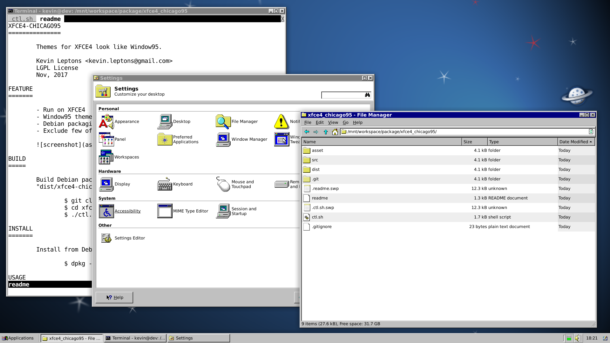

XFCE4-CHICAGO95
===============

Themes for XFCE4 look like Window95.

Kevin Leptons <kevin.leptons@gmail.com> <br>
LGPL License <br>
Nov, 2017

FEATURE
=======

- Run on XFCE4
- Window95 theme
- Debian package distribution



BUILD
=====

Build Debian package, then result package will be locate in
"dist/xfce4-chicago95_version.deb".

```bash
$ git clone https://github.com/kevin-leptons/xfce4-chicago95
$ cd xfce4-chicago95
$ ./ctl.sh dist
```

INSTALL
=======

Install from Debian package

```bash
$ dpkg -i xfce4-chicago95_1.0.0-1_all.deb
```

USAGE
=====

Active themes.

```bash
$ xfce4-chicago95 active
```
Deactive xfce4-chicago95 and restore default XFCE4 themes.

```bash
$ xfce4-chicago95 deactive
```

REMOVE
======

```bash
$ xfce4-chicago95 deactive
$ apt-get remove xfce4-chicago95
```

REFERENCES
==========

Chicago95 - Original package
https://github.com/grassmunk/Chicago95

XFCE - Lightweight Desktop environement for UNIX-like OS
https://xfce.org/

Debian - Free Operating System
https://www.debian.org/
